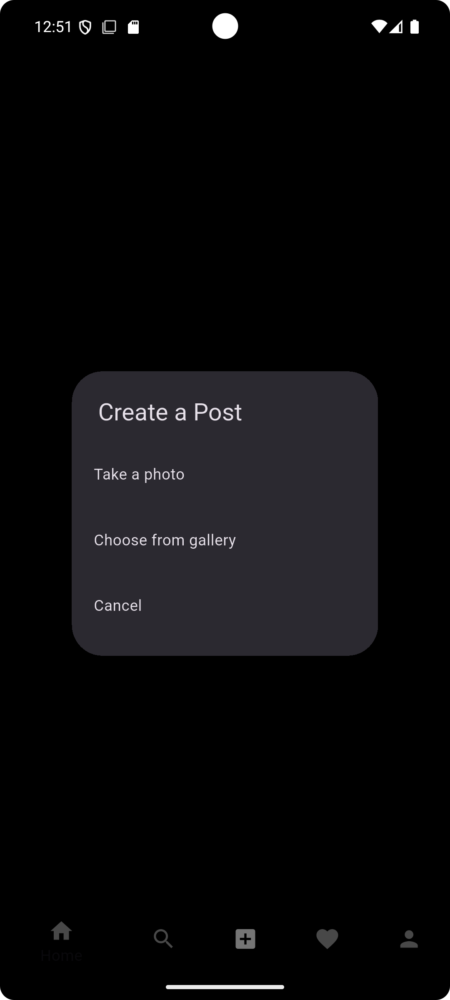

# Instagram Clone

## Project Overview
This project is a clone of Instagram, built using **Flutter** for the frontend, **Firebase** for authentication and real-time database, and **Cloudinary** for image storage. It allows users to sign up, log in, post images, like and comment on posts, and follow/unfollow other users. The app provides a smooth and engaging user experience similar to Instagram.

> 🚧 **Note:** This is an ongoing project and is currently under development. New features and improvements are being added regularly.

## Features
- **User Authentication**: Sign up and log in using Firebase Authentication.
- **Post Creation**: Upload images with captions, which are stored in Cloudinary.
- **Feed**: View posts from users you follow in a scrollable feed.
- **Likes and Comments**: Like and comment on posts made by others.
- **Follow/Unfollow**: Follow or unfollow users to personalize your feed.
- **Profile Page**: View and edit your profile, and see all your posts.
  
## Tech Stack
- **Frontend**: Flutter
- **Backend**: Firebase (Authentication, Firestore)
- **Image Storage**: Cloudinary

## 📸 Screenshots

